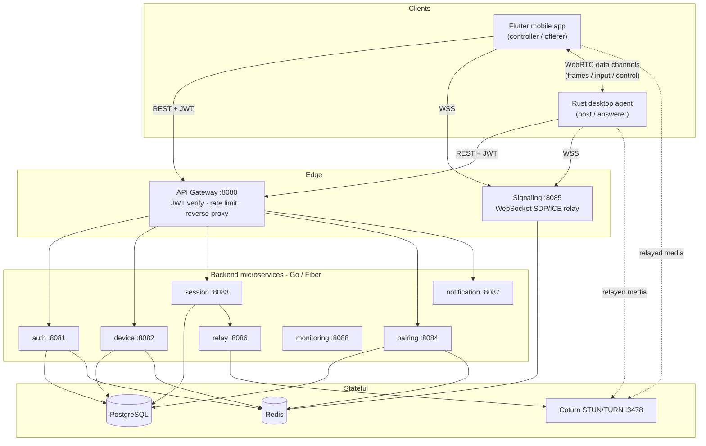
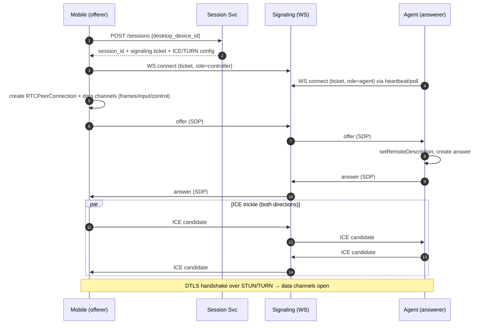
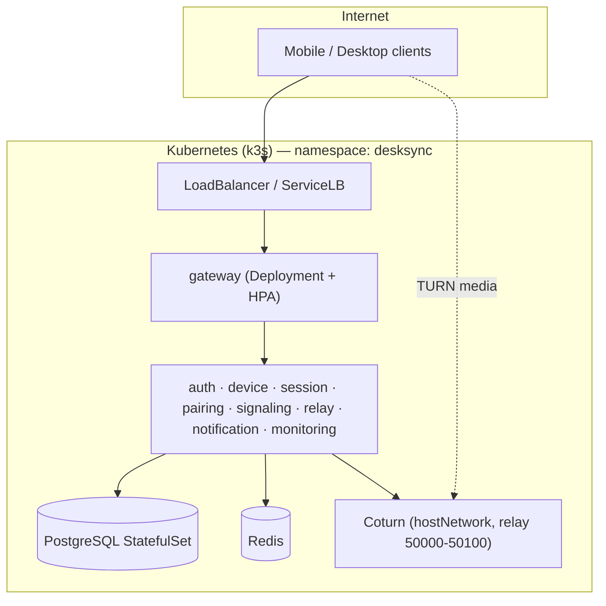

# DeskSync — Architecture & System Design

> Full technical walkthrough: the components, every service, the end-to-end data
> flows, the streaming pipeline, deployment, and **every library with its purpose**.
> For step-by-step run/deploy commands see [`RUNBOOK.md`](RUNBOOK.md).
>
> A rendered, diagram-friendly version of this document is in
> [`architecture.html`](architecture.html) (open it in a browser).

---

## 1. What DeskSync is

DeskSync is a **secure remote desktop**: you control your laptop (the *host*) from
your phone (the *controller*) over the internet. It is built on three edges tied
together by a Go backend:

- **Rust desktop agent** (host) — captures the screen, injects keyboard/mouse
  input, and answers WebRTC sessions.
- **Flutter mobile app** (controller) — logs in, pairs, lists devices, and views
  & controls the remote screen.
- **Go microservices backend** — identity, device presence, pairing, session
  brokering, and WebRTC signaling.

Design pillars:

| Principle | Meaning |
|-----------|---------|
| **Zero-trust media** | The backend brokers identity + connection setup but the media path is peer-to-peer (WebRTC); a session key can be derived end-to-end so the server can't read the stream. |
| **Fail closed** | No input executes while a peer is offline; sessions reconnect automatically. |
| **Clean architecture** | Domain logic is isolated behind interfaces — Go interfaces, Rust traits, Riverpod providers. |
| **Operable by default** | Every service exposes `/health`, `/ready`, `/metrics`, structured JSON logs, correlation IDs. |

---

## 2. High-level component diagram



---

## 3. The three edges in detail

### 3.1 Backend — Go microservices (`backend/`)

A Go **workspace** (`go.work`) with one module per service under `services/` and
shared libraries in `pkg/`. Only the **gateway** is publicly exposed; it verifies
JWTs and reverse-proxies to internal services. The **signaling** service is also
reachable (WebSocket) for SDP/ICE exchange.

| Service | Port | Responsibility | Stores |
|---------|------|----------------|--------|
| **gateway** | 8080 | TLS ingress, JWT verification, rate limiting, reverse proxy to all services | Redis (rate limit) |
| **auth** | 8081 | Registration, login, Google/GitHub OAuth, JWT issuance + refresh rotation | PostgreSQL, Redis |
| **device** | 8082 | Device registration (public key), presence/heartbeat, revocation | PostgreSQL, Redis |
| **session** | 8083 | Session lifecycle, timeouts, event log, ICE config, issues signaling tickets | PostgreSQL |
| **pairing** | 8084 | QR + manual-code pairing, trust relationships (codes hashed at rest, TTL, attempt limits) | PostgreSQL, Redis |
| **signaling** | 8085 | WebSocket relay of SDP/ICE + presence; verifies stateless signaling tickets | Redis (pub/sub) |
| **relay** | 8086 | Issues time-limited TURN credentials (HMAC over the Coturn static-auth secret) | — (Coturn) |
| **notification** | 8087 | Push (FCM) + email delivery | PostgreSQL |
| **monitoring** | 8088 | Health aggregation / alert hooks | — |

**Cross-service coupling to know:** the **session** service *issues* signaling
tickets and the **signaling** service *verifies* them via a shared
`SIGNALING_TICKET_SECRET` (`pkg/signalticket`). Tickets are stateless (HMAC-signed
+ short TTL), so signaling holds no session state and scales horizontally.

### 3.2 Desktop agent — Rust Cargo workspace (`desktop-agent/`)

A headless Tokio daemon split into focused crates so platform-specific code stays
behind traits (and the default build is dependency-free / CI-testable). Native
backends (real capture/input/WebRTC) are enabled with `--features native`.

| Crate | Role |
|-------|------|
| `core` | Config, types, session runtime primitives, shared errors |
| `crypto` | E2E channel primitives — X25519 → HKDF-SHA256 → AES-256-GCM (wire-compatible with the mobile Dart side) |
| `capture` | Screen capture behind a trait; native backend uses `xcap` (SCK/DXGI/PipeWire) |
| `input` | Keyboard/mouse/scroll injection behind a trait; native backend uses `enigo`; clipboard via `arboard` |
| `transport` | WebSocket signaling client (`tokio-tungstenite` + rustls), SDP/ICE plumbing |
| `media` | JPEG frame encoder (`jpeg-encoder`) + the WebRTC **answerer** peer (`webrtc` crate) — this is where frame chunking lives |
| `backend` | REST client for enrollment: auth, device registration, pairing initiation (`reqwest` + rustls) |
| `devtools` | Allowlisted developer shortcuts (git/docker/kubectl/helm/ssh) over the control channel |
| `config-ui` | The `desksync-agent` binary: wires everything together, hosts the session runtime, renders the pairing QR |

### 3.3 Mobile — Flutter app (`mobile/`)

Feature-first structure: `lib/features/<feature>/{presentation, application, domain}`,
with `app/` (routing/theme) and `core/` (networking, storage, DI). State via
**Riverpod**, routing via **GoRouter**, WebRTC via **flutter_webrtc**.

Key features: `auth`, `pairing` (QR scan via `mobile_scanner`), `devices`
(presence list), `signaling` (WebSocket client), `viewer` (WebRTC session + frame
rendering + touch → input mapping).

---

## 4. End-to-end data flows

### 4.1 Enrollment & auth

1. Agent and mobile each **register a device** (public key) via the gateway.
2. Users authenticate (email/password or OAuth); the gateway returns a **JWT
   access token** (+ refresh token). Every REST call carries the JWT; the gateway
   verifies it before proxying.
3. The agent stores its `device_id` + tokens and sends periodic **heartbeats**
   (device service) so the mobile sees it **online**.

### 4.2 Pairing (one-time trust)

```mermaid
sequenceDiagram
    autonumber
    participant A as Desktop Agent
    participant G as Gateway
    participant P as Pairing Svc
    participant M as Mobile
    A->>G: register device (public key)
    M->>G: register device (public key)
    M->>G: POST /pairing/initiate {desktop_device_id}
    G->>P: create pairing (pending)
    P-->>M: QR payload + manual code (hashed at rest)
    Note over A: Agent shows QR / code
    M->>G: POST /pairing/confirm {pairing_id, code, mobile_device_id}
    G->>P: verify (hash compare, TTL, attempt limit)
    P-->>G: pairing active + trusted
    G-->>M: 200 Pairing
    Note over A,M: Persistent trust; auto-reconnect enabled
```

### 4.3 Session establishment (signaling + WebRTC)

The **mobile is the offerer**, the **agent is the answerer**. Signaling only
brokers SDP/ICE; the media path is peer-to-peer.



> **Correctness detail (fixed in this codebase):** ICE candidates must not be
> applied before the remote description, and `sdpMid` must never be null — the
> Android `org.webrtc` build crashes otherwise. The mobile serializes signal
> handling, buffers remote ICE until the answer is applied, and always sends a
> non-null `sdpMid`.

### 4.4 Streaming pipeline (as actually implemented)

The screen is streamed as **JPEG frames over a reliable+ordered WebRTC data
channel** (not an SRTP video track). Because a whole JPEG exceeds the SCTP max
message size, the agent **chunks** each frame; the mobile reassembles.

```mermaid
flowchart LR
    CAP["Capture (xcap)<br/>BGRA frame"] --> ENC["Encode (jpeg-encoder)<br/>~720p, ~20fps"]
    ENC --> CHK["Chunk: 16 KiB pieces<br/>[frame_id u32][idx u16][count u16][payload]"]
    CHK -->|"'frames' data channel<br/>(reliable + ordered)"| RASM["Reassemble by frame_id<br/>(newest wins)"]
    RASM --> DEC["Decode → ui.Image"]
    DEC --> PNT["CustomPainter render<br/>(bypasses ImageCache)"]
    PNT --> TCH["Touch / key / scroll events"]
    TCH -->|"'input' / 'control' channels"| INJ["Input injection (enigo)"]
```



Performance safeguards baked in:

- Agent **skips JPEG encoding** for any session whose `frames` channel has no
  attached viewer (`frames_open()`), so stale sessions can't CPU-starve the live
  one.
- Each session is **answered at most once** to avoid peer leave/rejoin churn.
- Mobile keeps **only the newest** decoded frame and disposes the previous one —
  bounded memory, no `ImageCache` blow-up.

### 4.5 Reconnect (offline → online)

```mermaid
sequenceDiagram
    autonumber
    participant M as Mobile
    participant SIG as Signaling
    participant A as Agent
    Note over M,A: Network drops on one side
    M--xSIG: WS closed
    Note over M: UI shows "reconnecting"; no input executes
    loop backoff with jitter
      M->>SIG: reconnect WS (fresh ticket)
    end
    A->>SIG: heartbeat (already reconnected)
    SIG-->>M: peer_present
    M->>SIG: renegotiate (offer/answer/ICE)
    Note over M,A: WebRTC re-established; session resumes
```

---

## 5. Deployment

Runs on **Kubernetes** (k3s in the live Azure environment) via an umbrella **Helm**
chart (`helm/desksync`). Only the gateway (and signaling) are exposed; Coturn uses
host networking with a pinned relay-port range.



Environment specifics (Azure IP, ports, NSG rules, Helm values) are documented in
[`RUNBOOK.md`](RUNBOOK.md). Values overrides: `values.yaml` (defaults),
`values-azure.yaml` (live), `values-vps.yaml`.

---

## 6. Libraries and their purpose (detailed)

### 6.1 Backend (Go)

| Library | Used for |
|---------|----------|
| `gofiber/fiber/v2` | HTTP framework for every service (routing, middleware, handlers) on top of `fasthttp` |
| `fasthttp` / `valyala/bytebufferpool` | High-performance HTTP engine underneath Fiber |
| `gofiber/contrib/websocket` + `fasthttp/websocket` | WebSocket transport for the **signaling** service |
| `golang-jwt/jwt/v5` | Issue + verify JWT access/refresh tokens (auth, gateway) |
| `jackc/pgx/v5` | PostgreSQL driver + connection pool (`puddle`) for all persistent services |
| `redis/go-redis/v9` | Redis client — rate limiting, presence, signaling pub/sub, pairing codes |
| `golang.org/x/crypto` | Password hashing and crypto helpers |
| `prometheus/client_golang` | `/metrics` instrumentation on every service |
| `google/uuid` | IDs for devices, sessions, pairings |
| `google.golang.org/protobuf` | Wire types where protobuf encoding is used |
| Shared `pkg/` | `config`, `logger`, `httpx`, `observability`, `errors`, `service`, `jwtauth`, `signalticket` (session↔signaling ticket HMAC) |

### 6.2 Desktop agent (Rust)

| Crate | Used for |
|-------|----------|
| `tokio` | Async runtime (multi-thread, timers, signals, sync) — the whole agent is async |
| `webrtc` (v0.17) | Pure-Rust WebRTC stack: the answerer peer, data channels, ICE/DTLS |
| `jpeg-encoder` | Encode captured BGRA frames to JPEG for the frame stream |
| `bytes` | Zero-copy buffers for chunked frame payloads |
| `xcap` *(native)* | Cross-platform screen capture (macOS SCK, Windows DXGI, Linux PipeWire) |
| `enigo` *(native)* | Cross-platform keyboard/mouse/scroll injection |
| `arboard` *(native)* | Clipboard read/write sync |
| `tokio-tungstenite` (+rustls) | WebSocket signaling client (pure Rust, no system OpenSSL) |
| `reqwest` (+rustls) | REST client for backend enrollment (auth, device, pairing) |
| `x25519-dalek`, `hkdf`, `sha2`, `aes-gcm`, `zeroize` | E2E secure channel: X25519 ECDH → HKDF-SHA256 → AES-256-GCM, with key zeroization |
| `qrcode` | Render the pairing QR payload as a scannable terminal QR |
| `serde` / `serde_json` | (De)serialize signaling messages, config, control commands |
| `tracing` / `tracing-subscriber` | Structured logging + the `frame stream stats` diagnostics |
| `anyhow` / `thiserror` | Error handling (app-level context vs. typed library errors) |
| `dirs` / `fs4` | Locate the config dir + file-lock the on-disk config/state |

### 6.3 Mobile (Flutter / Dart)

| Package | Used for |
|---------|----------|
| `flutter_webrtc` | Peer connection, data channels, ICE — the controller/offerer side |
| `flutter_riverpod` | App-wide state management + dependency injection (providers) |
| `go_router` | Declarative navigation / routing between screens |
| `dio` | HTTP client for the REST API (auth, devices, pairing, sessions) |
| `flutter_secure_storage` | Encrypted storage of JWT tokens + device keys |
| `hive` / `hive_flutter` | Local structured cache (device list, settings) |
| `mobile_scanner` | Scan the pairing QR code with the camera |
| `firebase_core` / `firebase_messaging` | FCM push notifications (session/pairing alerts) |
| `cryptography` | Pure-Dart X25519 / HKDF-SHA256 / AES-256-GCM — wire-compatible with the Rust `crypto` crate for the E2E channel |
| `crypto` | Synchronous SHA-256 for the TLS certificate-pinning callback |
| `cupertino_icons` | Icon set |

---

## 7. How to run (summary)

Full commands, endpoints, credentials location, and troubleshooting are in
[`RUNBOOK.md`](RUNBOOK.md). At a glance:

```bash
# Backend (local dev)
cp .env.example .env            # fill JWT/OAuth values
docker compose -f docker/docker-compose.yml up --build

# Backend (Kubernetes)
helm upgrade --install desksync ./helm/desksync -n desksync --create-namespace \
  -f ./helm/desksync/values-azure.yaml

# Desktop agent (the host / Mac being controlled)
cd desktop-agent
cargo build -p desksync-agent --features native
./target/debug/desksync-agent setup     # sign in, permissions, register, service
./target/debug/desksync-agent           # run it (DESKSYNC_LOG=debug for detail)

# Mobile app
cd mobile
flutter build apk --release --split-per-abi \
  --dart-define=DESKSYNC_API_BASE_URL=http://<host>:8080 \
  --dart-define=DESKSYNC_SIGNALING_URL=ws://<host>:8085/api/v1/signaling
```

**Flow to connect:** start backend → run agent (registers + goes online) →
open mobile app, log in → pair once (scan QR) → tap **Connect** → the phone
offers, the agent answers, data channels open, frames stream and touches control
the desktop.

---

## 8. Related documents

- [`RUNBOOK.md`](RUNBOOK.md) — run / deploy / troubleshoot
- [`docs/design/`](docs/design) — per-area design (signaling, pairing, security, database, API, desktop-agent, mobile-app, deployment, threat-model)
- [`docs/adr/`](docs/adr) — architecture decision records
- [`architecture.html`](architecture.html) — this document, rendered with diagrams
