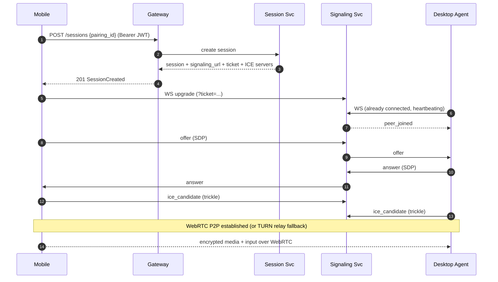

# API Design

DeskSync exposes two interfaces:

1. A **REST API** (JSON over HTTPS) for account, device, pairing, and session
   management, served by the API gateway under `/api/v1`. The authoritative
   contract is [`backend/api/openapi.yaml`](../../backend/api/openapi.yaml)
   (OpenAPI 3.1, validated in CI with Redocly).
2. A **WebSocket signaling protocol** used to negotiate the WebRTC peer
   connection between a phone and a laptop.

## Conventions

- **Base path**: `/api/v1`. The gateway is the only public ingress; it
  authenticates requests and reverse-proxies to internal services.
- **Auth**: `Authorization: Bearer <access_token>` (JWT). Access tokens are
  short-lived (15m default); refresh tokens rotate (see
  [security.md](security.md)).
- **Correlation**: every request carries/gets an `X-Request-ID` echoed in logs
  and stored on audit entries.
- **Errors**: uniform envelope `{ "error": "code", "message": "...", "request_id": "..." }`.
  Codes map to HTTP status via `pkg/errors`.
- **Rate limiting**: `429` with `Retry-After`. Login has stricter brute-force
  limits.

## REST surface (summary)

| Method | Path | Service | Purpose |
|--------|------|---------|---------|
| POST | `/auth/register` | auth | Email/password registration |
| POST | `/auth/login` | auth | Email/password login |
| GET | `/auth/oauth/{provider}/start` | auth | Begin Google/GitHub OAuth |
| GET | `/auth/oauth/{provider}/callback` | auth | OAuth code exchange |
| POST | `/auth/refresh` | auth | Rotate refresh, mint access |
| POST | `/auth/logout` | auth | Revoke refresh token |
| GET/POST | `/devices` | device | List / register devices |
| GET/DELETE | `/devices/{id}` | device | Fetch / revoke a device |
| POST | `/pairing/initiate` | pairing | Create QR + manual code |
| POST | `/pairing/confirm` | pairing | Confirm from mobile |
| GET/POST | `/sessions` | session | List / create sessions |
| GET | `/sessions/{id}` | session | Fetch a session |
| POST | `/sessions/{id}/end` | session | End a session |

Creating a session returns the signaling URL, a short-lived `signaling_ticket`,
and the ICE server list (STUN + time-limited TURN credentials from the relay
service).

## Connection establishment flow



## WebSocket signaling protocol

- **Endpoint**: `wss://<host>/api/v1/signaling`
- **Authorization**: the WS upgrade must present a short-lived `signaling_ticket`
  (query param or `Sec-WebSocket-Protocol`) issued by the session service. The
  ticket binds the socket to a `session_id` and device identity.
- **Framing**: one JSON object per message matching the `SignalEnvelope` below.
  This is mirrored by the Rust agent's `desksync-transport` crate.

### Envelope

```json
{
  "v": 1,
  "nonce": 42,
  "ts_ms": 1730000000000,
  "session_id": "b1c2...",
  "payload": { "kind": "offer", "sdp": "v=0..." }
}
```

| Field | Type | Purpose |
|-------|------|---------|
| `v` | int | Protocol version (currently `1`). |
| `nonce` | int | Strictly increasing per-connection counter (replay protection). |
| `ts_ms` | int | Client clock (ms). Messages older than a skew window are rejected. |
| `session_id` | string | Binds the message to a session. |
| `payload.kind` | enum | `offer` \| `answer` \| `ice_candidate` \| `heartbeat` \| `bye`. |

### Payload kinds

| kind | Fields | Direction |
|------|--------|-----------|
| `offer` | `sdp` | initiator -> peer |
| `answer` | `sdp` | responder -> peer |
| `ice_candidate` | `candidate`, `sdp_m_line_index` | both (trickle ICE) |
| `heartbeat` | - | both (keep-alive + presence) |
| `bye` | - | either (tear down) |

### Rules

- The signaling server **only routes** envelopes between the two peers of a
  session; it never inspects or stores media and cannot decrypt the WebRTC
  stream.
- **Replay protection**: the receiver rejects any envelope whose `nonce` does
  not strictly increase (implemented by `ReplayGuard` in `desksync-transport`
  and mirrored server-side in Redis).
- **Offline behavior**: if either peer's socket drops, the server marks it
  absent and buffers nothing; per spec, no actions execute while offline. On
  reconnect the client re-authenticates with a fresh ticket and renegotiates.
- **Heartbeats** every ~15s drive presence (`devices.status`) via a Redis key
  with TTL.
