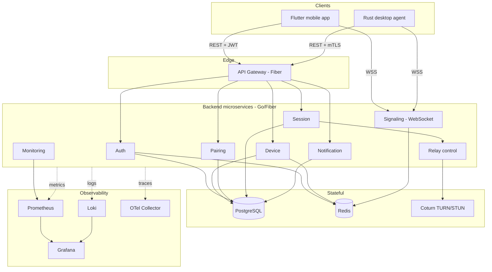
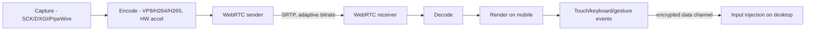
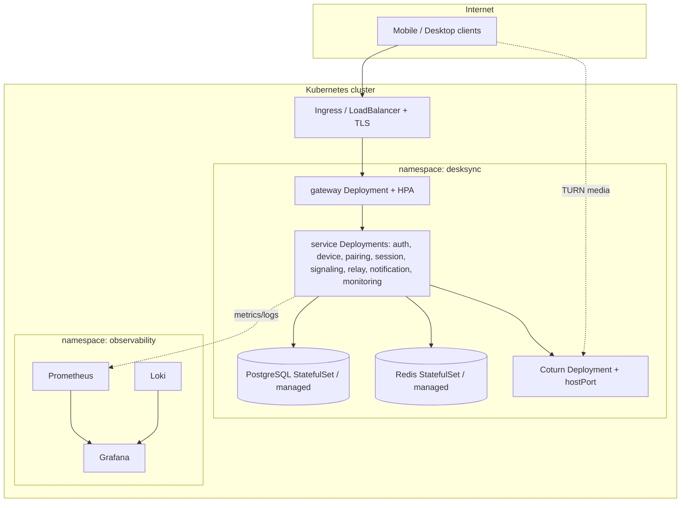

# Architecture

DeskSync is a secure remote-desktop system with three clients/edges — a **Rust
desktop agent**, a **Flutter mobile app**, and a **Go microservices backend** —
connected by **WebRTC** for low-latency, end-to-end-encrypted media and input.

## Guiding principles

- **Clean Architecture / SOLID**: domain logic is isolated from transport and
  infrastructure; dependencies point inward. Subsystems are injected behind
  interfaces (Go interfaces, Rust traits, Riverpod providers).
- **Zero trust for media**: the backend brokers identity and connection setup
  but cannot decrypt the stream (see [security.md](security.md)).
- **Fail closed**: no action executes while a device is offline; reconnect is
  automatic.
- **Operable by default**: every service exposes `/health`, `/ready`,
  `/metrics`, structured JSON logs, and correlation IDs.

## Component diagram



## Pairing sequence

```mermaid
sequenceDiagram
    autonumber
    participant A as Desktop Agent
    participant G as Gateway
    participant P as Pairing Svc
    participant M as Mobile

    A->>G: register device (public key)
    M->>G: register device (public key)
    M->>G: POST /pairing/initiate {desktop_device_id}
    G->>P: create pairing (pending)
    P-->>M: QR payload + manual code (hashed at rest)
    Note over A: Agent shows QR/code in Tauri config UI
    M->>G: POST /pairing/confirm {pairing_id, code, mobile_device_id}
    G->>P: verify code (hash compare, TTL, attempts)
    P-->>G: pairing active + trusted
    G-->>M: 200 Pairing
    Note over A,M: Persistent trust established; auto-reconnect enabled
```

## Reconnect sequence (offline -> online)

```mermaid
sequenceDiagram
    autonumber
    participant M as Mobile
    participant SIG as Signaling
    participant D as Desktop Agent

    Note over M,D: Network drops on one side
    M--xSIG: WS closed
    Note over M: UI shows "reconnecting"; no input executes
    loop backoff with jitter
      M->>SIG: reconnect WS (fresh ticket)
    end
    D->>SIG: heartbeat (already reconnected)
    SIG-->>M: peer_present
    M->>SIG: renegotiate (offer/answer/ICE)
    Note over M,D: WebRTC re-established; session resumes
```

## Streaming pipeline



## Deployment diagram (Kubernetes)



## Service responsibilities

| Service | Responsibility | Stores |
|---------|----------------|--------|
| gateway | TLS ingress, JWT verification, rate limiting, reverse proxy | Redis (rate limit) |
| auth | Registration, login, OAuth, JWT + refresh rotation | PostgreSQL, Redis |
| device | Device registration, presence/heartbeat, revocation | PostgreSQL, Redis |
| pairing | QR/manual pairing, trust relationships | PostgreSQL, Redis (codes) |
| session | Session lifecycle, timeouts, event log, ICE config | PostgreSQL |
| signaling | WebSocket relay of SDP/ICE, presence | Redis (pub/sub, nonces) |
| relay | Issues time-limited TURN credentials | — (Coturn) |
| notification | Push (FCM) + email delivery | PostgreSQL |
| monitoring | Health aggregation, alert hooks (infra: Prometheus/Grafana/Loki) | — |

## Code structure

- **Backend** ([`backend/`](../../backend)): Go workspace (`go.work`) with one
  module per service under `services/` and shared libraries in `pkg/`
  (`config`, `logger`, `httpx`, `observability`, `errors`, `service`).
- **Desktop agent** ([`desktop-agent/`](../../desktop-agent)): Cargo workspace
  with crates `core`, `capture`, `input`, `transport`, and the `desksync-agent`
  binary (`config-ui`).
- **Mobile** ([`mobile/`](../../mobile)): Flutter, feature-first `lib/`
  (`app/`, `core/`, `features/<feature>/{presentation,application,domain}`).

Architecture decisions are recorded in [`docs/adr/`](../adr).
