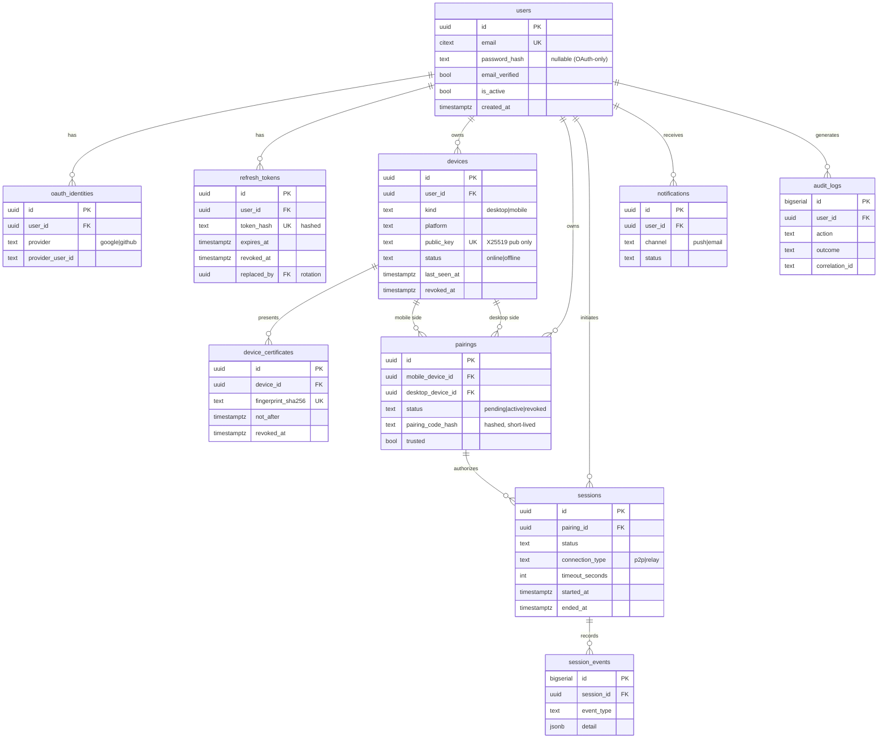

# Database Design

DeskSync uses **PostgreSQL** as the single source of truth, **Redis** for
ephemeral/hot state, and **SQLite** on the desktop agent for a local cache.

- **PostgreSQL**: users, devices, pairings, sessions, certificates, audit.
- **Redis**: device presence (`presence:{device_id}` with TTL heartbeats),
  signaling pub/sub channels, rate-limit counters, short-lived pairing codes.
- **SQLite** (agent): cached config, workspace shortcuts, offline queue.

Migrations live in [`backend/migrations/`](../../backend/migrations) in
[golang-migrate](https://github.com/golang-migrate/migrate) `NNNNNN_name.up.sql`
/`.down.sql` format and are validated (apply + rollback) in CI. All primary keys
are UUIDs (`gen_random_uuid()` from `pgcrypto`); high-volume append-only tables
(`session_events`, `audit_logs`) use `BIGSERIAL`.

## Entity-Relationship Diagram

## Table reference

| Table | Purpose | Key notes |
|-------|---------|-----------|
| `users` | Account identity | `email` is `CITEXT` unique; `password_hash` NULL for OAuth-only accounts (Argon2id when set). |
| `oauth_identities` | Federated logins | Unique on `(provider, provider_user_id)`; one user can link Google + GitHub. |
| `refresh_tokens` | Refresh-token rotation | Stored **hashed**; `replaced_by` forms a rotation chain; revocation via `revoked_at`. |
| `devices` | Registered laptops/phones | Stores **public key only**; `status` + `last_seen_at` track presence; `revoked_at` for revocation. |
| `device_certificates` | Device certs (mTLS) | `fingerprint_sha256` unique; supports rotation and CRL-style revocation. |
| `pairings` | Persistent trust | Unique `(mobile_device_id, desktop_device_id)`; `pairing_code_hash` short-lived. |
| `sessions` | Remote-control sessions | `connection_type` records p2p vs relay; `timeout_seconds` drives idle expiry. |
| `session_events` | Append-only session log | JSONB `detail`; indexed by session + time. |
| `notifications` | Push/email outbox | Status machine `pending -> sent/failed`. |
| `audit_logs` | Security audit trail | Insert-only; carries `correlation_id` from the gateway. |

## Design decisions

- **Server never stores private keys.** `devices.public_key` holds only the
  X25519 public key; private keys stay on the device (Keyring on desktop,
  Secure Storage/Keychain on mobile). This is enforced by schema and reviewed in
  the [threat model](threat-model.md).
- **Secrets are hashed at rest.** Refresh tokens and pairing codes are stored as
  hashes so a database compromise does not yield usable credentials.
- **Append-only audit.** `audit_logs`/`session_events` are only ever INSERTed by
  application code, giving a tamper-evident trail for security review.
- **Presence in Redis, not Postgres hot-path.** Heartbeats update a Redis key
  with TTL; `devices.status`/`last_seen_at` are periodically reconciled to avoid
  write amplification on every heartbeat.
- **Cascade deletes** model ownership: removing a user removes their devices,
  pairings, sessions, and tokens.
