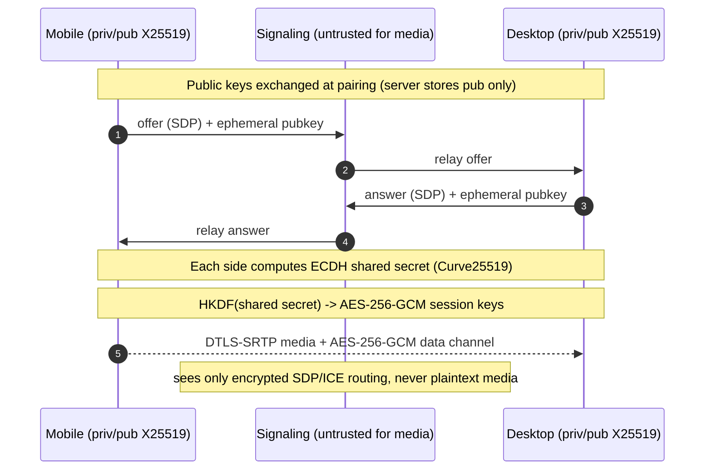

# Security Design

Security is the primary requirement of DeskSync: a remote desktop grants full
control of a developer's machine. The guiding principle is **zero trust in the
backend for media confidentiality** — the servers broker connections and
identity but must never be able to decrypt the remote-desktop stream.

## Security objectives

1. **End-to-end confidentiality** of screen, audio, input, clipboard, and files
   between the paired phone and laptop.
2. **Strong device + user authentication** so only the legitimate owner can
   connect.
3. **No usable secret material at rest on the server** — private keys never
   leave devices; the server stores public keys only.
4. **Defense in depth**: TLS everywhere, certificate pinning, replay/nonce
   protection, rate limiting, and auditable actions.
5. **Fail closed**: if a device is offline or a check fails, no action executes.

## Identity and authentication

### User authentication
- **Email + password**: passwords hashed with **Argon2id** (memory-hard, tuned
  parameters). Never stored or logged in plaintext.
- **OAuth**: Google and GitHub via authorization-code flow with `state` (CSRF)
  and PKCE. The provider identity links to `oauth_identities`.
- **JWT access tokens** (~15 min) signed with a rotating secret; carried as
  `Authorization: Bearer`.
- **Refresh tokens** (long-lived) stored **hashed** with rotation: each use
  issues a new token and revokes the predecessor (`refresh_tokens.replaced_by`).
  Reuse of a revoked token triggers family revocation (token-theft detection).

### Device authentication
- Each device generates an **X25519** keypair on first run. The **private key
  never leaves the device** (OS Keyring on desktop; Keychain/Keystore via
  Flutter Secure Storage on mobile). Only the **public key** is registered.
- Devices are additionally issued a **device certificate** (`device_certificates`)
  used for mutual authentication of the agent<->backend channel.
- **Biometric unlock** (Face ID / fingerprint) and a **PIN fallback** gate the
  mobile app before it can start a session.

## End-to-end encryption model

- **Key agreement**: ephemeral **ECDH over Curve25519 (X25519)** per session,
  authenticated by the long-term device keys exchanged at pairing (prevents MITM
  because the signaling server cannot substitute keys without detection).
- **Key derivation**: **HKDF-SHA256** expands the shared secret into distinct
  keys for each direction/purpose.
- **Bulk encryption**: **AES-256-GCM** (AEAD) for the application data channel;
  **DTLS-SRTP** secures the WebRTC media path. Nonces are unique per message;
  GCM provides integrity + confidentiality.
- **Perfect forward secrecy**: ephemeral session keys mean a compromise of one
  session does not expose past/future sessions.

## Transport security and pinning

- **TLS 1.2+ (Rustls / platform TLS)** for all REST and WebSocket traffic.
- **Certificate pinning** on mobile (Dio) and desktop (Rustls) against the
  backend's leaf/intermediate public-key hashes, with a backup pin to allow
  rotation. Pin failures abort the connection.
- **HSTS** and secure cookie flags at the gateway.

## Replay and integrity protection

- **Signaling nonces**: every `SignalEnvelope` carries a strictly increasing
  `nonce` and `ts_ms`. Receivers reject non-increasing nonces (`ReplayGuard`)
  and messages outside a small clock-skew window. Server-side, seen nonces are
  tracked per session in Redis with TTL.
- **Idempotency**: state-changing REST endpoints accept an idempotency key where
  retries are expected (e.g. session creation).
- **AEAD tags** (GCM) detect any tampering of encrypted payloads.

## Session security

- **Session expiration**: access tokens expire (~15m); sessions have an idle
  `timeout_seconds` after which they auto-terminate.
- **Explicit controls**: remote lock, disconnect, and remove-device are
  first-class operations that immediately invalidate active sessions.
- **Device revocation**: revoking a device sets `devices.revoked_at`, revokes
  its certificates, drops its pairings, and forcibly ends its sessions. Revoked
  devices cannot re-authenticate.

## Abuse prevention

- **Rate limiting** per IP and per account at the gateway (token-bucket in
  Redis), returning `429` + `Retry-After`.
- **Brute-force protection**: login attempts are counted per account/IP; after a
  threshold the account is temporarily locked and an alert is emitted.
- **Pairing codes** are short (8 digits), single-use, short-lived, hashed at
  rest, and rate-limited to defeat guessing.

## Secrets management

- No secrets in source; configuration via environment / mounted secrets (see
  [`.env.example`](../../.env.example)). In Kubernetes, secrets are provided via
  Secret objects / external secret managers (Phase 10).
- Signing keys and TURN static-auth secrets are rotated; JWT verification
  supports multiple active keys during rotation.

## Logging and audit

- **Structured JSON logs** with request/correlation IDs; secrets and tokens are
  never logged.
- **Append-only `audit_logs`** capture security-relevant actions (login, logout,
  pair, revoke, session start/stop) with outcome, IP, and correlation ID.

## Mapping to spec requirements

| Spec requirement | Mechanism |
|------------------|-----------|
| AES-256 GCM | Data-channel AEAD; SRTP for media |
| ECDH / Curve25519 | X25519 ephemeral key agreement |
| Private keys never leave devices | Keyring/Keychain/Keystore; server stores pub only |
| Certificate pinning | Rustls (desktop) + Dio (mobile) public-key pins |
| Replay protection / nonce | Strictly increasing nonce + Redis seen-set + GCM tags |
| Session expiration | Token TTL + idle session timeout |
| Biometric unlock / PIN | Mobile local auth before session start |
| Device revocation | `revoked_at` + cert revocation + session teardown |
| Rate limiting / brute force | Redis token-bucket + login attempt lockout |
