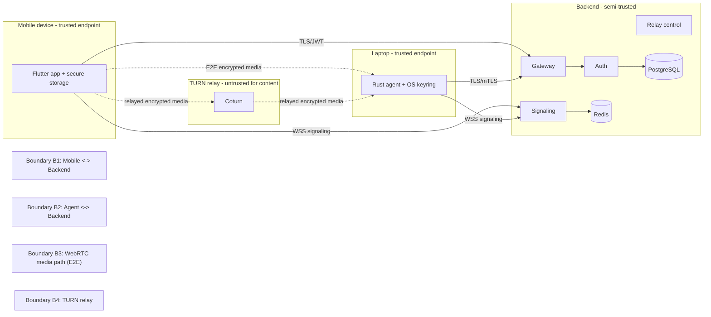

# Threat Model

This document models threats to DeskSync using **STRIDE** across the system's
trust boundaries. It complements [security.md](security.md), which describes the
controls in detail.

## Scope and assets

Primary assets to protect:

- **A1** — Live remote-desktop stream (screen, audio, clipboard, files).
- **A2** — Input control of the desktop (keyboard/mouse/gestures).
- **A3** — User credentials and tokens (passwords, JWTs, refresh tokens).
- **A4** — Device private keys (X25519) and certificates.
- **A5** — Backend datastores (PostgreSQL, Redis).

## Trust boundaries

- **B1** Mobile ↔ Backend (REST + signaling)
- **B2** Desktop agent ↔ Backend (REST + signaling)
- **B3** WebRTC media/data path between peers (end-to-end)
- **B4** TURN relay (carries encrypted media when P2P fails)

## STRIDE analysis

### B1 / B2 — Client ↔ Backend

| STRIDE | Threat | Mitigation |
|--------|--------|------------|
| Spoofing | Attacker impersonates a user or device | JWT bearer auth; OAuth `state`+PKCE; device certificates (mTLS) for the agent; Argon2id passwords |
| Tampering | Modify requests in transit | TLS 1.2+; certificate pinning; AEAD on signaling payloads |
| Repudiation | User denies an action | Append-only `audit_logs` with correlation IDs, IP, outcome |
| Information disclosure | Steal tokens/PII | TLS + pinning; refresh tokens hashed at rest; no secrets in logs |
| Denial of service | Flood login/API | Redis token-bucket rate limits; login lockout; gateway timeouts |
| Elevation of privilege | Access another user's devices | Per-user authorization checks; ownership enforced by `user_id` FKs and cascade scoping |

### B3 — WebRTC media path (end-to-end)

| STRIDE | Threat | Mitigation |
|--------|--------|------------|
| Spoofing | MITM substitutes keys during signaling | Ephemeral X25519 authenticated by long-term device keys exchanged at pairing; server cannot forge without detection |
| Tampering | Alter media/input frames | DTLS-SRTP + AES-256-GCM AEAD; any tamper fails the auth tag |
| Repudiation | Deny sending input | Session events logged; input bound to authenticated session |
| Information disclosure | Backend/relay reads the stream | E2E encryption; signaling/relay never hold media keys |
| Denial of service | ICE flooding / connection churn | Rate-limited signaling; short-lived signaling tickets; heartbeat timeouts |
| Elevation of privilege | Replay old offers to hijack session | Strictly increasing nonces + timestamp window + Redis seen-set |

### B4 — TURN relay

| STRIDE | Threat | Mitigation |
|--------|--------|------------|
| Spoofing | Unauthorized use of relay | Time-limited HMAC TURN credentials issued by the relay service |
| Tampering | Modify relayed packets | Content is E2E encrypted; relay only forwards ciphertext |
| Information disclosure | Relay operator inspects traffic | Relay sees only encrypted media; no keys present |
| Denial of service | Bandwidth exhaustion | Per-credential quotas/TTL; monitoring + alerting |

## Endpoint compromise (out-of-band)

If a trusted endpoint (phone or laptop) is fully compromised, E2E encryption
cannot help that endpoint. Mitigations reduce blast radius:

- Biometric/PIN gate on mobile; OS keyring/enclave storage of private keys.
- Device revocation immediately ends sessions and invalidates certificates.
- Session idle timeouts and explicit remote lock/disconnect.
- Anomaly alerts (new device, new location) via the notification service.

## Residual risks & follow-ups

- **Malicious insider with DB access**: cannot decrypt media (no keys) but can
  read metadata; mitigated by least-privilege DB roles and audit (Phase 9/10).
- **Supply-chain**: dependency pinning, `cargo audit` / `govulncheck` /
  `flutter pub` advisories in CI (added in the security-hardening phase).
- **Compromised signaling ticket**: short TTL + single session binding limits
  exposure.

This model is revisited at the end of each phase and formally re-reviewed in
Phase 9 (Security Hardening).
